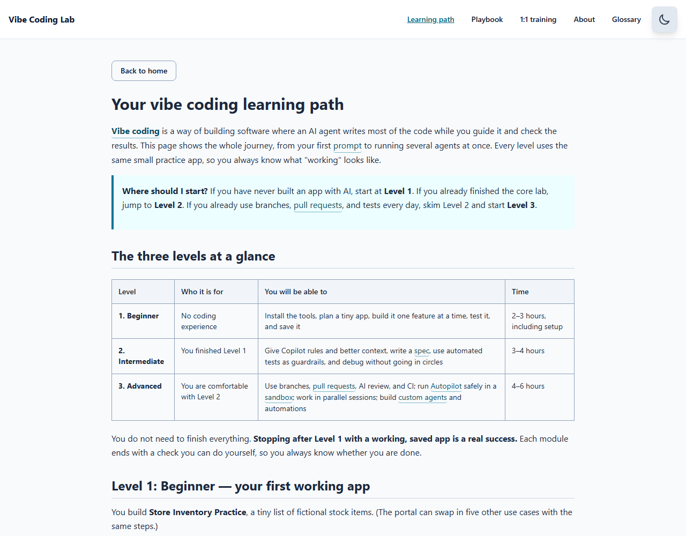

# VibeCoding101

Build and verify a small local app with the **GitHub Copilot desktop app**. No coding experience is assumed. You guide the AI, review its changes, and check what actually works.

## Learners: start here

**Allow 60–90 minutes after setup** (allow 30–60 minutes for a first installation, or longer if access needs approval). Start with Retail, or choose one of [six bounded use cases](docs/use-cases.md). Nothing needs to be installed just to read the first module.

1. [Set up the desktop app, tools, and a separate learner folder](docs/lab-00-prerequisites.md).
2. [Plan one record type and four small increments](docs/lab-01-plan.md).
3. [Scaffold, preview, and build one feature at a time](docs/lab-02-build.md).
4. [Test positive and negative cases, review, and save a local commit](docs/lab-03-test-and-save.md).
5. [Explain the result and its limits](docs/lab-04-completion.md).
6. [Choose an optional extension](docs/lab-05-next-steps.md), or stop at your completed core lab.
7. Optionally [add project instructions and create one review skill](docs/lab-06-instructions-and-skills.md).
8. Optionally [connect, verify, and remove a public documentation MCP server](docs/lab-07-mcp.md).

### Keep going: beginner to advanced

The **[learning path](docs/learning-path.md)** (also at `?page=path` in the portal) continues with the same practice app across three levels. Each module ends with checks you can run yourself.



| Level | Modules |
| --- | --- |
| **1. Beginner** | Labs 00–04 above: your first working, tested, saved app |
| **2. Intermediate** | Labs 06–07 above, then [08: specs and context](docs/lab-08-specs-and-context.md), [09: tests as guardrails](docs/lab-09-tests-as-guardrails.md), [10: debug and recover](docs/lab-10-debug-and-recover.md) |
| **3. Advanced** | [11: branches, pull requests, and AI review](docs/lab-11-branches-prs-and-review.md), [12: Autopilot, parallel sessions, and sandboxing](docs/lab-12-autopilot-and-parallel-sessions.md), [13: custom agents, automations, and your capstone](docs/lab-13-custom-agents-and-automations.md) |

**Screenshots show what to expect.** Lab 02 shows each increment of the practice app as it looked in a real rehearsal, and Labs 09–10 show real test failures, error overlays, and a bug that only a human caught. Screenshots are of the learner app and this portal; this course does not include screenshots of the Copilot desktop app itself, whose layout changes between versions.

**Required:** a GitHub account with a Copilot plan, a supported computer, internet, Node.js 24 LTS with npm, Git, and a browser. Get the desktop app from its [official download page](https://github.com/features/ai/github-app). It is generally available for Windows, macOS, and Linux; this course gives Windows/macOS setup steps. Check your organization's installation/app policy and your plan's usage limits before the workshop.

The learning loop is **plan → small scaffold → preview → implement one feature → verify → save**. All records are synthetic. A local prototype is not a production system, a compliance claim, or a publicly deployed app.

### Two different projects

- **Learning portal:** this repository displays instructions and tracks learner-reported checkpoints.
- **Your learner app:** a new, empty, dedicated folder selected in a local Copilot desktop session. Do not scaffold inside the portal repository.

The session may use a separate **worktree**, so check its actual working directory. Follow the generated app's actual preview URL rather than assuming port 5173. Keep the portal and generated app in separate browser tabs.

The portal's checklist is your report of evidence, not an automated inspection of your app. Browser-stored progress and sample records are not durable cross-device backups.

Need a definition? See the [plain-English glossary](GLOSSARY.md).

### Playbook and 1:1 training

- **[Vibe coding playbook](docs/vibe-coding-playbook.md)** (free, also at `?page=playbook` in the portal): the build loop, reusable prompts, a review checklist, fixes for when you get stuck, and safety rules on one page.
- **1:1 training** (optional, paid, at `?page=coaching`): book a private video session with the author. Booking and payment happen on an external scheduling page; the portal never handles card details. Maintainers turn booking on with the [1:1 training setup guide](docs/coaching-setup.md).

### Built for your first time

The portal provides **hover, keyboard-focus, and tap explanations** for dotted-underlined terms in lesson prose. Press Escape to dismiss them, or turn them off with **Hide word explanations**. Commands and file contents remain unchanged when copied. Each code box says whether its text belongs in **Copilot chat**, a **terminal**, or a **file**. Chat prompts wrap to fit narrow screens without changing the copied text; commands and file examples keep their original layout.

Use the **Lesson map** to jump to a numbered step and bookmark its URL. The setup module includes separate Windows/macOS installation routes, a first harmless terminal command, GitHub account setup, and an optional **tool-output helper**. The helper interprets pasted version strings locally; it does not run commands or verify your computer.

Prefer less on screen? Choose **Read one step at a time**. You will see the module overview, one complete numbered step, or its final troubleshooting/reference section. Use **Next section**, **Previous section**, or **Choose a section** to move through it. Each step keeps its explanations, commands, expected results, and substeps together. **Show full lesson** restores the complete text at the same heading.

Reading mode and the section you explicitly select are remembered separately for each use case and stage in this browser. **Resume this lab** returns there; browser Back/Forward and bookmarked section links work too. Scrolling alone does not save a new section. **Download evidence** includes a resume link, but that URL carries no notes or checkpoint results. If browser storage is blocked, navigation keeps your notes in the current tab; download them before closing or refreshing. Reset clears the selected use case's reading positions along with its checkpoints and notes.

Jumping to checkpoints or skipping the header keeps the selected reading section in the link, so refreshing there does not return you to the overview. Opening the completion link too early leaves your current reading position intact.

**Reading section 3 of 7 is not a completion score.** Moving between sections never checks evidence boxes, runs commands, or verifies your generated app. Required evidence still controls core completion.

The optional skills/MCP modules are available for read-ahead without claiming core completion. Their separate checkpoints and your notes are saved per use case and included in **Download evidence**. A skipped or blocked MCP connection is not reported as a successful tool test. Use the source dates and [review record](docs/lab-review.md) to distinguish documentation checks, automated portal checks, and desktop steps still needing a human rehearsal.

## Maintainers: run this learning portal locally

These commands run **the portal**, not the app learners build. A fork, cloud account, or push is not needed for local use.

1. Open PowerShell on Windows or Terminal on macOS. Navigate to a parent folder where you keep projects.
2. **Terminal commands — one line at a time:**

   ```text
   git clone https://github.com/russrimm/Vibe-Coding-101.git
   cd Vibe-Coding-101
   npm ci
   npm run dev
   ```

3. Expect Vite to print `Local:` and a URL. Open that exact URL in your browser.
4. Optionally add this cloned folder as a local project in the Copilot desktop app to maintain the portal. Keep learner builds in a different project.
5. In a second terminal in the portal folder, run the existing checks:

   ```text
   npm run lint
   npm run build
   npm run test:e2e
   ```

   Each successful command exits with code 0. If Playwright reports a missing Chromium executable, run `npx playwright install chromium`, then retry the tests. Do not treat missing browsers as a passing test. On Windows with Edge already installed, the repository also supports this PowerShell alternative:

   ```powershell
   $env:PLAYWRIGHT_CHANNEL = 'msedge'
   npm run test:e2e
   ```

   This chooses Edge for that terminal's test runs; it does not install a new browser.

6. To inspect built files locally, run `npm run preview` and open its printed URL. This still does not publish the portal.

### Where the curriculum lives

- `docs/lab-00-prerequisites.md` through `docs/lab-07-mcp.md`: eight canonical wizard modules, also rendered in the portal; 06–07 are optional instructions/skills and MCP walkthroughs.
- `docs/learning-path.md` and `docs/lab-08-*.md` through `docs/lab-13-*.md`: the intermediate and advanced learning path, rendered at `?page=path` (`?page=path&module=lab-08` for one module) by `src/components/PathPage.tsx`. Register new path modules in `src/data/learningPathModules.ts` (metadata, safe for Node tests) and `src/data/learningPath.ts` (Markdown imports).
- `docs/images/`: screenshots referenced by relative Markdown paths such as `images/lab-02-increment-1-list.png`. GitHub renders them directly; `MarkdownRenderer` resolves the same paths to bundled assets. Every image needs descriptive alt text and must be referenced (`tests/documentation.spec.ts` checks both).
- `src/data/curriculum.ts`: imports those modules and adapts Retail examples for the selected use case.
- `src/types/industry.ts`: six small use-case definitions.
- `src/data/wizardChecklist.ts`: checkpoint IDs, labels, and evidence descriptions.
- `src/components/steps`: stage presentation; shared checklist behavior belongs to the wizard.
- `src/data/glossary.json` and `src/lib/glossary.ts`: shared definitions and whole-term matching for accessible prose explanations and the searchable glossary.
- `src/lib/lessonOutline.ts`: module-qualified heading IDs used by both the lesson map and Markdown headings, including Windows line-ending handling.
- `src/components/LessonReader.tsx` and `src/lib/readerNavigation.ts`: optional guided/full reading, intact section partitions, URL navigation, and keyboard focus. The existing progress store holds optional, backward-compatible per-stage reading positions.
- `src/components/SetupReadiness.tsx` and `src/lib/setupChecks.ts`: optional local-only tool-output interpretation.
- `docs/vibe-coding-playbook.md` and `src/components/PlaybookPage.tsx`: the standalone playbook page.
- `src/components/CoachingPage.tsx`, `src/data/coaching.ts`, and `src/hooks/useSitePage.ts`: the 1:1 training page, its public build-time settings (see `.env.example`), and `?page=` routing.
- [Curriculum review and release checks](docs/lab-review.md): findings, changes, and outstanding validation.

### Optional and historical documents

Older filenames remain as redirects or clearly labeled advanced design references, not alternate beginner routes. Graph, service-health, AI assistant, and [deployment planning](docs/Lab09-DeployToAzure.md) require separate technical/access reviews. No cloud resources are provisioned by following the core course.

## License

The repository's existing documentation identifies the license as MIT. A standalone license file is not currently included; maintainers should confirm licensing before redistribution.
