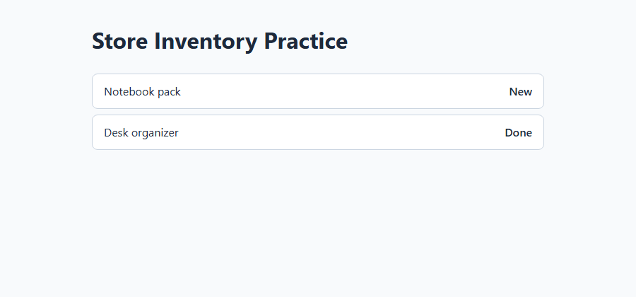
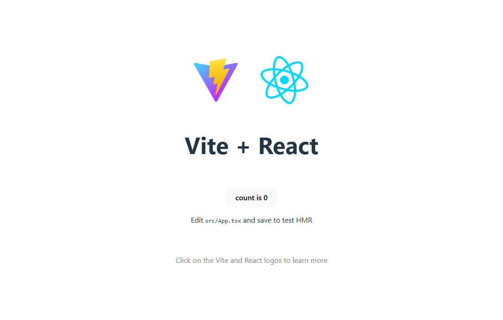
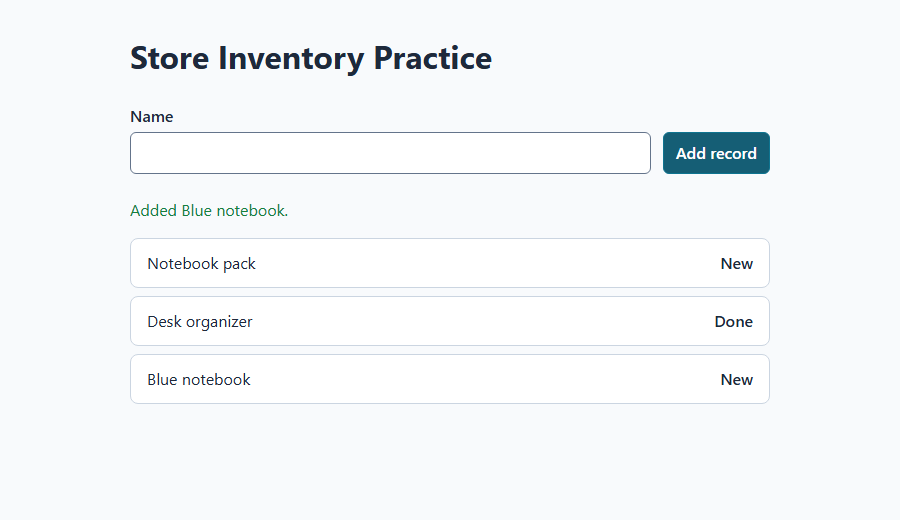
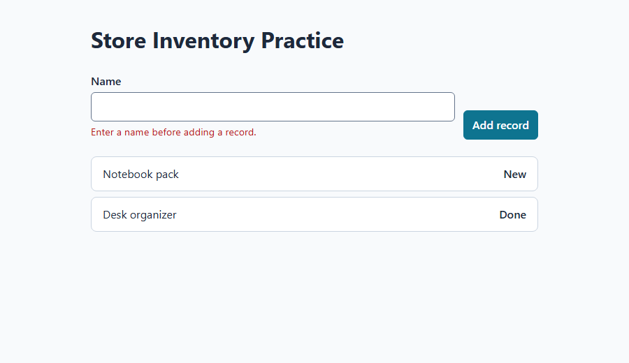
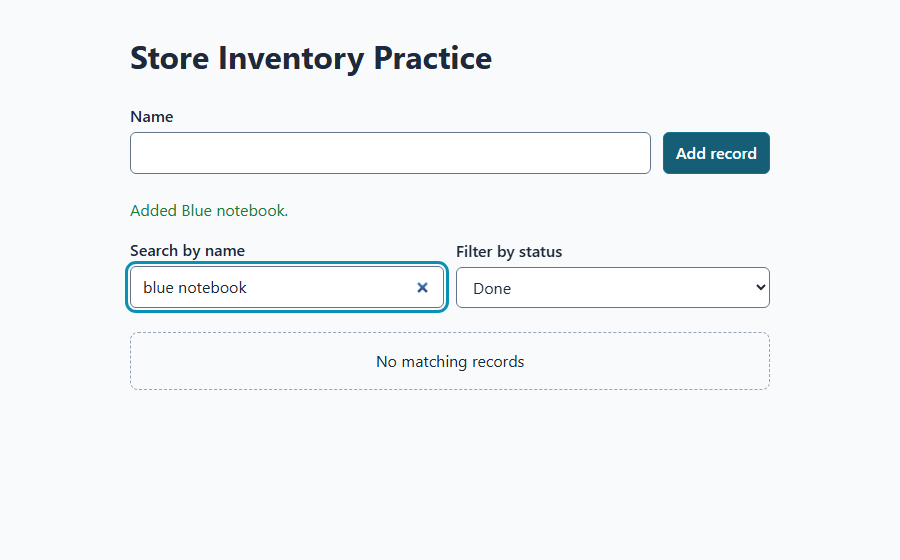
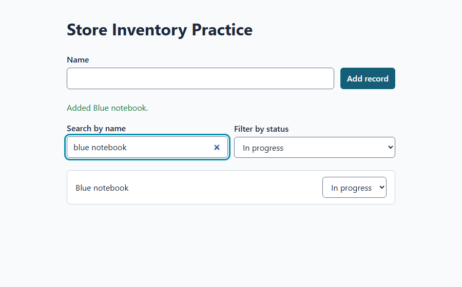
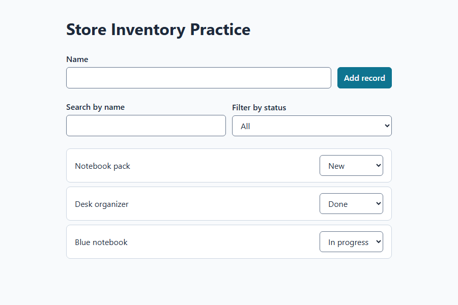

# Lab 02: Build one feature at a time

**Time:** 30–40 minutes. **Prerequisite:** your [Lab 01 plan](lab-01-plan.md) is small enough to explain.

## What you will learn

- Create a small runnable scaffold.
- Check a preview before adding more features.
- Give Copilot specific feedback.
- Understand browser-only storage.

## Step 1: Create only the first page

1. Check that the current desktop session still points to your learner workspace. Review your plan, then select **Interactive** in the mode dropdown below the prompt field so you can check each increment before the next one.
2. Ask Copilot to create the starter project for you. You do not type any commands; Copilot runs them and shows you the output. **Copilot chat:**

   ```prompt
   Create a React + TypeScript starter app in this session's working directory.
   First confirm the directory is my empty learner folder (Git metadata is fine).
   If it contains another app or unexpected files, stop and tell me.
   Use the pinned, rehearsed generator with exactly this command, keeping "." as the target:
   npm exec --yes --package=create-vite@8.3.0 -- create-vite . --template react-ts --no-interactive --no-rolldown
   Then run npm install, npm run build, and npm run lint, one at a time.
   Show me each command's output and exit code. Do not overwrite or delete files,
   upgrade packages, or change any settings. If a command fails, stop and show me
   the first error instead of trying fixes.
   ```

3. **What Copilot is doing:** the first command downloads and runs a starter generator called `create-vite`, pinned to the exact version this lab was tested with. It creates a React/TypeScript starter in the current folder (`.`). Copilot will ask your permission first, because it downloads code from the internet. That is expected; approve it only if the command matches the prompt. The extra options skip the generator's questions and pick standard Vite. `--yes` only answers npm's own "download this package?" question; it does not give Copilot any extra permissions. There is deliberately no overwrite option.
4. `npm install` downloads the starter's dependencies and creates a **lockfile** (a list of the exact package versions). The build and lint checks prove the untouched starter works before you change it. **Expected:** Copilot reports the project was created, installation finished, build created a `dist` folder, and build and lint each finished with exit code **0**. Package counts and timings vary. If anything fails, stop and use the recovery prompt below; do not let Copilot delete existing files or disable checks.

   > **Yellow `npm warn allow-scripts` lines?** Newer npm versions (11.16 and later) warn when a package wants to run an install script, for example `esbuild`. In our 2026-10-02 rehearsal with npm 11.17.0 this was only a notice: install, build, and lint all still succeeded. Do not let Copilot run `npm approve-scripts` or change npm settings just to silence it. Ask Copilot to explain the message if you are curious.
5. **Verify:** ask Copilot, "List the files in this folder and the scripts in package.json." You should see `package.json`, `package-lock.json`, `index.html`, and a `src` folder. The scripts are `dev` (`vite`), `build` (`tsc -b && vite build`), `lint` (`eslint .`), and `preview` (`vite preview`). Use the starter's existing `npm run lint`; do not add another lint tool.
6. Now use this **chat prompt** to make the first small change:

   ```prompt
   Implement only increment 1 of our agreed Store Inventory Practice plan.
   First confirm the current workspace and inspect any existing files.
   We just created the React/TypeScript starter with create-vite 8.3.0.
   Confirm it is that starter. If it contains another app or unexpected work,
   stop and report it; do not overwrite it or run the scaffold again.
   Show the installed React, TypeScript, and Vite versions.
   Keep package-lock.json and the working dev, build, lint, and preview scripts.
   Do not upgrade packages or install a UI library.
   Use simple accessible HTML and CSS, no UI framework required.
   Replace the starter's logo/counter page with this small list:
   Show the heading Store Inventory Practice and exactly two synthetic records:
   Notebook pack (New), Desk organizer (Done). Use type-safe id/name/status data.
   No forms, storage, authentication, APIs, cloud, or other features yet.
   Explain the files changed and how to preview this page. Stop after this increment.
   ```

7. Review the file-write requests before allowing them. Keep all four real scripts; do not accept replacements that always report success.

> The generator is pinned to the rehearsed version, not claimed to be the latest. Its React/TypeScript template uses TypeScript 5 and ESLint and supports the Node.js 24 lab baseline. This separate learner app need not use the portal repository's older Vite version. Dependency ranges still resolve during the first install: record the installed versions and keep the resulting lockfile. For later reinstalls, ask Copilot to use `npm ci`, which installs exactly what the lockfile lists. Pinning the generator alone does not freeze every dependency or make the AI-generated features identical.

## Step 2: Start and inspect the preview

1. **Chat prompt:**

   ```prompt
   In this session's actual working directory, run npm run dev and keep the
   local dev server running for our preview. Use a loopback-only address,
   not --host 0.0.0.0. Show the exact Local URL from Vite's output.
   If another app is using the first port, use a free port; do not stop that app.
   Do not deploy or expose a public tunnel.
   ```

2. **Expected output:** Vite says it is ready and prints a `Local:` URL. Use that **exact URL**. The learning portal may already use port 5173; your generated app could use another port.
3. **Browser action:** open the reported URL in a new browser tab, or use the desktop app's preview if available. Confirm the address refers to your generated app.
4. **Verify:** see the correct heading and exactly Notebook pack — New and Desk organizer — Done. A chat message saying “server started” is not enough.

   

   *Retail example: increment 1 in our rehearsal. Your colors and layout may differ; your heading, sample names, and statuses should match your own use case.*

   If you still see the Vite and React logos with a **count is 0** button, that is the untouched starter. Increment 1 has not been applied yet, or you opened a different app's URL.

   

   *Retail example: the untouched starter page. Seeing this after increment 1 means the change did not apply.*
5. Keep the server running while you test. Copilot runs it in the background, so you can keep sending prompts in the same session. If the page stops loading later, ask: "Is the dev server still running? If not, start it again in this workspace and show me the Local URL."

## Step 3: Add a record

1. **Chat prompt:**

   ```prompt
   Implement only increment 2 in Store Inventory Practice.
   Add a labeled Name input and an Add record button.
   Trim the name; reject an empty or whitespace-only name with an inline error
   associated with the field. Render input as text, never HTML.
   On success create a unique id, default status New, clear the input, and announce
   success. Keep the two existing records unchanged.
   Use real labels/buttons, visible keyboard focus, and readable contrast.
   Do not add other features or packages unless required; explain any need first.
   Show changed files, then stop so I can test.
   ```

2. **Browser action:** enter **Blue notebook**, then choose **Add record**.
3. **Verify:** exactly one new record appears with status **New**.
4. Leave Name empty and submit again; then enter only spaces and submit.
5. **Verify:** neither attempt adds a record. You see a useful error. Do not continue until these checks pass.

   

   *Retail example: a successful add in our rehearsal. One new record with status New, and a confirmation message.*

   

   *Retail example: a rejected spaces-only name. An error appears next to the field, and the record count did not grow.*

## Step 4: Update status and find records

1. **Chat prompt:**

   ```prompt
   Implement only increment 3.
   Give each record a labeled status select: New, In progress, Done.
   Add a labeled Search by name field (case-insensitive substring match)
   and a labeled Filter by status select (All, New, In progress, Done).
   Search and status filters must work together. Show "No matching records"
   when there are zero matches; keep the controls usable.
   Use labels that identify the affected record to screen readers.
   Do not add delete, navigation, charts, or backend features. Stop for my checks.
   ```

2. **Browser action:** change **Blue notebook** from **New** to **In progress**.
3. Search for **Blue notebook** using lowercase letters. Only that record should remain.
4. Choose the **Done** filter while keeping that search. Expect **No matching records**.

   

   *Retail example: search and filter working together in our rehearsal. The controls stay usable.*

5. Change the filter to **In progress**. Expect the record to return.

   
6. Clear the search and choose **All**. Expect all three records. Confirm the two original statuses did not change.

## Step 5: Save records in this browser

1. **Chat prompt:**

   ```prompt
   Implement only increment 4.
   Persist the full records array to localStorage with the key vibe-practice-retail-v1.
   Load and validate stored data safely before the first save, including unique
   string ids, trimmed nonempty names, and allowed statuses.
   Seed the two initial samples only when no saved value exists; do not reseed
   on every render or overwrite valid saved data during initialization.
   If reading, parsing, or writing fails, keep the app usable in memory and
   display a clear warning that changes are not being saved.
   Never silently overwrite unreadable data. Do not store search/filter state.
   Explain that localStorage is not a secure database or a backup.
   Do not add sync, accounts, or external services. Stop for my refresh test.
   ```

2. **Browser action:** confirm **Blue notebook** is still present with **In progress**. If development reloads earlier in-memory work, add it once and set its status again.
3. Refresh the browser tab using its reload button.
4. **Verify:** all three records remain, the changed status remains, and the seed records are not duplicated.

   

   *Retail example: after refreshing the page in our rehearsal. Three records, no duplicates, and the added record kept In progress.*

5. Ask Copilot: "Run npm run lint again and show me the output and exit code." In our rehearsal, a common AI-generated pattern (saving inside a React `useEffect` that also sets state) **failed lint** with `react-hooks/set-state-in-effect`, even though the page worked. If you see that rule, ask Copilot to save in the same event handler that changes the records instead of in an effect. Do not disable the rule. [Lab 10](lab-10-debug-and-recover.md) explains this real error in detail.
6. Notice the storage limit: this data belongs to one browser profile and one **origin** (scheme, host, and port). Another browser, `127.0.0.1` instead of `localhost`, or a different port has different storage. Clearing site data or ending a private-browsing session can remove it. It is not shared across devices and is not protected storage for secrets.

## Step 6: Recover from a failure without rebuilding everything

1. Copy the exact error Copilot showed you, or describe the browser behavior. Remove private paths or secrets before sharing.
2. **Chat prompt — replace the bracketed parts:**

   ```prompt
   I am testing Store Inventory Practice in the same local workspace.
   Action: [the exact command or browser steps].
   Expected: [the specific result].
   Actual: [what happened instead].
   Error: [paste the relevant exact error, or say no error was shown].
   Find the cause and propose the smallest fix. Do not rewrite the app,
   remove validation, weaken lint/type checks, upgrade unrelated packages,
   or change other working features. Explain changed files.
   After the fix, repeat the failing check and tell me what you observed.
   ```

3. Review the proposed change. Allow only the bounded fix.
4. Repeat the browser check **yourself**, then recheck the last feature that worked.
5. If two attempts do not resolve it, stop expanding scope and ask your facilitator to inspect the error and working directory.

## Common issues

- **Wrong page:** check the exact Vite URL Copilot reported; you may be viewing the portal.
- **Connection refused:** the dev server stopped. Ask Copilot to restart it in the same workspace and show the current URL.
- **Port occupied:** ask Copilot to use another local port without stopping someone else's app. Expect separate browser storage at the new origin.
- **Missing script:** ask Copilot to show `package.json` and the error, and to restore only the missing real script.
- **Missing package:** ask Copilot to check the folder first. For an existing, unchanged lockfile, it can run `npm ci` to restore the recorded packages; that replaces the `node_modules` folder, so have it explain before running. Do not let it delete the lockfile as a general fix.

## Verification and summary

Confirm the small plan, preview, valid/invalid input, status/search/filter, and refresh checks in the shared portal checklist. You have a **local prototype**, not a deployed or production-approved system.

**Next:** [Lab 03: Test, review, and save](lab-03-test-and-save.md).
