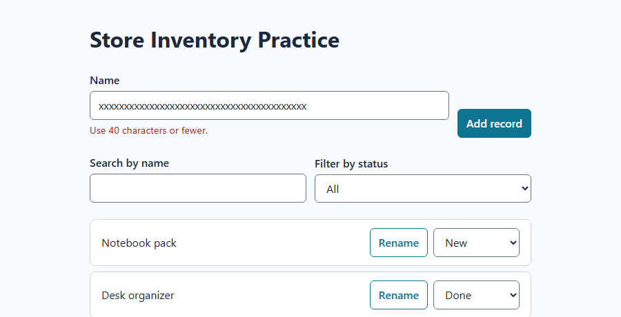
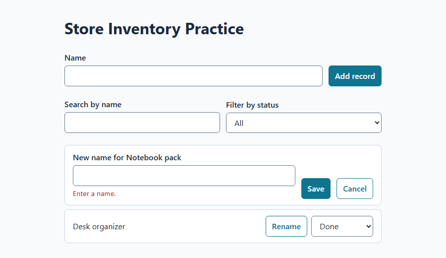
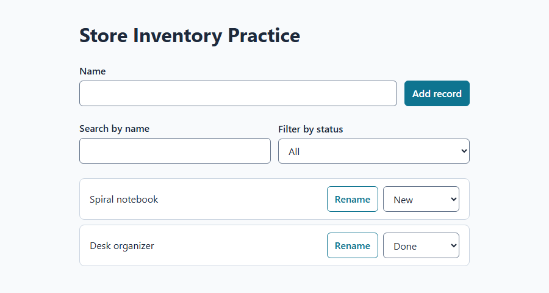

# Lab 09: Use tests as guardrails

**Time:** 45–60 minutes. **Prerequisite:** the committed rename spec from [Lab 08](lab-08-specs-and-context.md).

## What you will learn

- Add an automated test runner (Vitest) to your learner app.
- Move logic into small functions that are easy to test, without changing behavior.
- Use **red → green**: watch a test fail for the right reason, then make it pass.
- "Test the tests" by breaking code on purpose and confirming a test notices.
- Build the rename feature from your spec, guarded by tests.

## Before you start

So far you have checked your app by clicking through it. That works, but you have to repeat every click after every change. An **automated test** is a small program that checks your code for you in about a second. Tests are the guardrails that let you, and later Autopilot, move faster without breaking things.

A test that has **never failed** proves very little. It might be checking nothing. That is why this lab has you watch every new test fail first.

Your session should still be in your learner project with a clean `git status`. Use **Interactive** mode for this whole lab.

> **These steps were rehearsed** on Windows with Node.js 24.19.0, npm 11.17.0, and the `create-vite@8.3.0` React/TypeScript starter from Lab 02. That rehearsal installed Vitest 5.0.1. Newer versions may print slightly different output. The meaning stays the same.

## Step 1: Add Vitest and one first test

**Vitest** is a test runner made for Vite projects. It reads files ending in `.test.ts` and runs the checks inside them.

1. **Copilot chat:**

   ```prompt
   Add Vitest to this project as a dev dependency. Add a "test" script to
   package.json that runs "vitest run" (run once, not watch mode).
   Do not install any other packages and do not change existing scripts.
   Show me the package.json diff before you install anything.
   ```

2. Review the diff. **Expected:** one new `devDependencies` entry for `vitest` and one new script, `"test": "vitest run"`. Approve the install.
3. You may see `npm warn allow-scripts` lines during install. They are a security notice from newer npm versions about packages that want to run install scripts. In our rehearsal they were advisory and everything worked. Do not let Copilot run `npm approve-scripts` just to hide the message; ask it to explain the message if you are curious.

## Step 2: Move the rules into a testable file

Right now your name check, search, and storage logic probably live inside your main component. That is hard to test. You will move the **pure logic** (code that takes inputs and returns outputs, with no screen involved) into its own file. This is a **refactor**: the code changes shape, but the app must behave exactly the same.

1. **Copilot chat:**

   ```prompt
   Refactor without changing behavior. Create src/records.ts and move into it,
   as exported functions: validateName(name) which returns an error message or
   an empty string; filterRecords(records, search, statusFilter); and
   parseStoredRecords(raw) which returns valid records or null.
   Also export the record type, the status list, and the sample records.
   Update the app component to use these functions. Do not change any text,
   layout, or behavior the user can see. Then run npm run build and npm run lint.
   ```

2. **Verify in the browser** (yourself, not just Copilot's summary): add a record, try an empty name, change a status, search, filter, and refresh. Everything should work exactly as before.
3. **Verify the checks:** build and lint both exit with code 0.

> **Real issue we hit here:** in our rehearsal the original app saved to localStorage inside a `useEffect` that also called `setState`. The starter's lint rules (`react-hooks/set-state-in-effect`) reject that. If lint fails with that rule, read [Lab 10 Step 3](lab-10-debug-and-recover.md#step-3-fix-a-real-lint-error-without-weakening-the-rules). Do not turn the rule off.

## Step 3: Lock in today's behavior with tests

Before changing anything, write tests for what already works. These are sometimes called **characterization tests**: they describe current behavior so you will notice if it changes by accident.

1. **Copilot chat:**

   ```prompt
   Create src/records.test.ts using Vitest. Test only the functions in
   src/records.ts. Include: validateName accepts "Blue notebook"; rejects ""
   and "   "; filterRecords matches names regardless of upper or lower case;
   search and status filter work together; parseStoredRecords returns null for
   text that is not JSON and for two records with the same id.
   Use plain describe/it/expect. Then run npm test and show the full output.
   ```

2. Read the test file. Each `it(...)` line should describe one behavior in plain English.
3. If Copilot did not already run the tests, ask: "Run npm test and show me the full output."

4. **Expected output** (timings will differ):

   ```output
    Test Files  1 passed (1)
         Tests  7 passed (7)
   ```

5. Commit this checkpoint: `test: add vitest and characterization tests`. Review the staged files first, as in Lab 03.

## Step 4: Red — write a failing test from the spec

Your spec says names must be **40 characters or fewer**. The app does not enforce that yet. Write the test **first**.

1. **Copilot chat:**

   ```prompt
   Add tests only. Do not change src/records.ts yet.
   In src/records.test.ts add: validateName rejects a 41-character name with
   the message "Use 40 characters or fewer." and accepts exactly 40 characters.
   Run npm test and show me the failure. Explain in one sentence why it fails.
   ```

2. **Expected:** the new 41-character test **fails**. The 40-character test passes, because nothing rejects it yet. Our rehearsal printed:

   ```output
    FAIL  src/records.test.ts > name length limit > rejects a name longer than 40 characters
   AssertionError: expected '' to be 'Use 40 characters or fewer.' // Object.is equality

    Test Files  1 failed (1)
         Tests  1 failed | 8 passed (9)
   ```

3. **Read the failure.** "Expected `''`" means `validateName` returned an empty string, which means "no error." That is the **right reason** to fail: the rule is missing. If it failed for another reason, such as a typo or a missing import, fix that first. A test that fails for the wrong reason teaches you nothing.

## Step 5: Green — make it pass, then show it in the app

1. **Copilot chat:**

   ```prompt
   Now make the failing test pass with the smallest change to validateName in
   src/records.ts. Use a named constant for the 40-character limit. The Add form
   must show this error the same way it shows the empty-name error.
   Do not change the tests. Run npm test, npm run build, and npm run lint.
   ```

2. **Expected test output:**

   ```output
    Test Files  1 passed (1)
         Tests  9 passed (9)
   ```

3. **Browser check:** type 41 characters into **Name** and choose **Add record**.

   

   *Example from our rehearsal. Your layout may look different. What matters is the error text and that no record was added.*

4. ⚠️ **Watch for "fixing" the test instead of the code.** If Copilot edits the test's expected message to match the code, that is cheating the guardrail. Say: "Do not change tests to make them pass. Change the code."
5. Commit: `feat: limit names to 40 characters`.

## Step 6: Test the tests

How do you know a passing test would catch a real bug? Break the code on purpose and see. This idea is called **mutation testing**. You are doing a tiny manual version.

1. **Copilot chat:**

   ```prompt
   I want to test my tests. In src/records.ts, find the line in validateName
   that trims the name (such as const trimmed = name.trim()). Temporarily
   remove .trim() so it reads const trimmed = name. Change nothing else.
   Then run npm test and show me the full output. Do not fix anything.
   ```

2. Read the diff Copilot shows before approving. Only that one line should change.
3. Let Copilot run the tests.
4. **Expected:** a test fails. In our rehearsal it was:

   ```output
    FAIL  src/records.test.ts > validateName > rejects a name made only of spaces
         Tests  1 failed | 8 passed (9)
   ```

   ✅ That is good news. Your tests noticed the bug. ❌ If **all tests still pass**, your tests are missing a case. Ask Copilot for a test that would catch it.

5. Undo your deliberate bug. **Copilot chat:**

   ```prompt
   Undo my deliberate bug by restoring src/records.ts to its last committed
   version with git restore -- src/records.ts. Restore only that one file.
   Then run npm test and git status --short and show me both outputs.
   ```

6. **Expected:** all 9 tests pass again, and Copilot reports no changed files.

## Step 7: Build rename from the spec, test-first

Now repeat the same loop for the real feature.

1. Attach the spec with `@docs/spec-rename-record.md`, then **Copilot chat:**

   ```prompt
   Implement rename from the attached spec, test-first.
   1. Add a failing test for a pure function renameRecord(records, id, newName)
      that renames only the matching record, trims the name, and keeps id and status.
      Run npm test and show me it fails.
   2. Stop and wait for me to say "continue".
   ```

2. Check that it failed for the right reason, such as `renameRecord is not a function`. Then say **continue**, followed by:

   ```prompt
   Make that test pass. Then add the rename UI: a Rename button on each record
   with an accessible name such as "Rename Notebook pack"; an inline labeled
   field; Save on Enter or the Save button; Cancel on Escape or a Cancel button;
   use validateName for errors, shown next to the field with role="alert".
   Save through the same localStorage path as other changes.
   Run npm test, npm run build, and npm run lint. Then list which acceptance
   checks from the spec I should run in the browser.
   ```

3. Run **every acceptance check from your spec** in the browser yourself.

   

   *Acceptance check 2 in our rehearsal: saving only spaces shows an error and keeps the old name.*

   

   *Acceptance checks 1 and 5: the new name appears, keeps its status, and survives a refresh.*

4. **Read every error message in context.** In our first rehearsal, the rename field said "Enter a name **before adding a record**" because it reused the Add form's message. All tests passed. Only a human reading the screen caught it. [Lab 10](lab-10-debug-and-recover.md) shows the fix.
5. Commit: `feat: rename records`.

## Common issues

- **`npm test` says "Missing script":** the `test` script was not added. Ask Copilot to add `"test": "vitest run"` to `package.json`.
- **Vitest stays running and never finishes:** it is in watch mode. Ask Copilot to stop that test run and make sure the `test` script is `vitest run`, not `vitest`.
- **Build fails with type errors in the test file:** the starter type-checks everything in `src`. Paste the first error to Copilot and ask for the smallest fix. Do not exclude tests from type checking.
- **A test passes before you write the code:** the test is not checking what you think. Ask: "Why does this test pass when the feature does not exist yet?"
- **Copilot wants to add React Testing Library or jsdom:** those are useful for testing components on screen, but they are more to learn. This lab tests pure functions only. You can add component tests later as a separate, planned change.

## Verification and summary

You are done when `npm test`, `npm run build`, and `npm run lint` all exit with code 0; you watched at least one test fail for the right reason before it passed; you broke the code on purpose and saw a test catch it; and every acceptance check in your rename spec passes in the browser.

**What you learned:** tests turn "I think it works" into "I can prove it in one second." Red → green proves each test can fail. Breaking code on purpose proves the tests are worth trusting.

**Source check:** 2026-10-02. Commands and outputs come from a local rehearsal with Vitest 5.0.1, Vite 7.3.6, React 19, and TypeScript 5.9. See the [Vitest guide](https://vitest.dev/guide/) for current details.

**Next:** [Lab 10: Debug and recover](lab-10-debug-and-recover.md).
