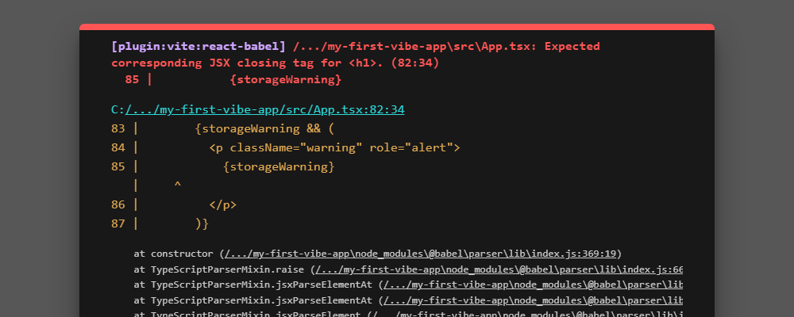
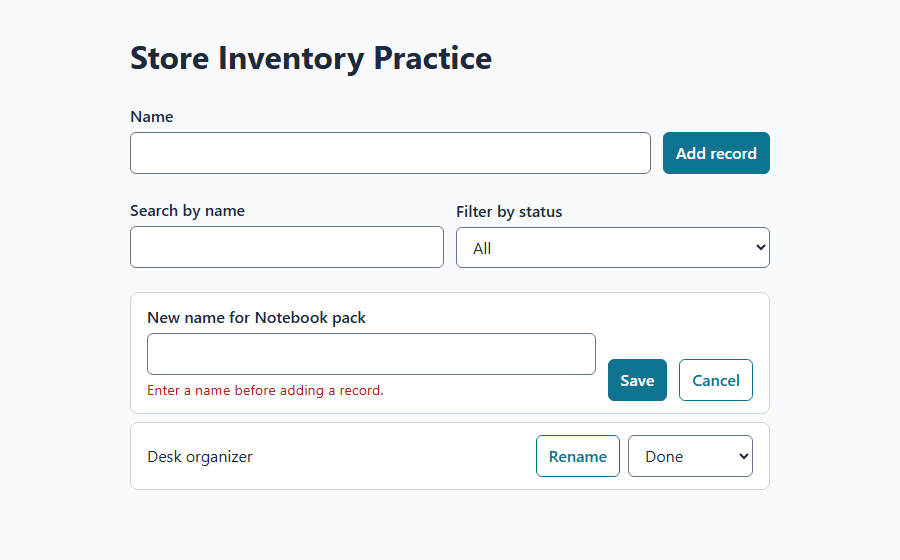

# Lab 10: Debug and recover

**Time:** 40–50 minutes. **Prerequisite:** [Lab 09](lab-09-tests-as-guardrails.md), with passing tests and a clean `git status`.

## What you will learn

- Find the real error message in the terminal, the browser, the error overlay, and test output.
- Write a bug report that gets a small, correct fix instead of a rewrite.
- Fix a real lint error the right way, without turning rules off.
- Use Git to see exactly what changed and to undo just one file.
- Try two fixes safely with a forked session, and break out of AI loops.

## Before you start

Every developer spends a large part of their time debugging. AI makes this faster, **if** you give it facts instead of feelings. "It's broken" gets a guess. "When I do X, I expect Y, but I see Z, and here is the exact error" gets a fix.

Keep your app's dev server running and its preview open. Use **Interactive** mode.

## Step 1: Know where errors show up

Errors appear in four places. Learn to check all four.

| Where | What it looks like | How to see it |
| --- | --- | --- |
| **Terminal running `npm run dev`** | Red text after you save a file | Look at the terminal where the dev server runs |
| **Error overlay in the browser** | A dark panel over your app with red text | Appears automatically for code that cannot compile |
| **Browser console** | Red messages in developer tools | Press **F12** (Windows) or **Option+Command+I** (Mac), then open **Console** |
| **Test, build, or lint output** | `FAIL`, `error`, or a nonzero exit code | Run `npm test`, `npm run build`, or `npm run lint` |

Here is the error overlay we saw during our rehearsal after a mistyped closing tag:



*The real Vite error overlay. The folder path was shortened for privacy. The first red line is the most important part.*

**How to read it:**

1. The **first red line** names the file and the problem: `App.tsx: Expected corresponding JSX closing tag for <h1>`.
2. The numbers in brackets, such as `(82:34)`, are **line:column**. The mistake is on or just before that line. Here, line 82 had `<h1>…</h2>`.
3. The long list of `at ...` lines below is the **stack trace**. For a beginner, it is usually safe to ignore. Copy it into a bug report anyway; Copilot can use it.

## Step 2: Write a bug report that gets a small fix

You used a simple version of this in Lab 02. Now add the parts that stop the AI from guessing.

1. **Copilot chat — replace every bracket:**

   ```prompt
   Bug report for Store Inventory Practice. Do not change code yet.
   Steps to reproduce: [numbered clicks or commands, starting from a fresh page load]
   Expected: [what should happen, quoting the spec if there is one]
   Actual: [what happened instead]
   Exact error: [paste the full first error and the file:line, or "no error shown"]
   Since when: [the last commit where it worked, if known]
   First, explain the most likely cause in two sentences and tell me which file
   and line you suspect. Then propose the smallest fix and a test that would
   fail before the fix and pass after it. Wait for my approval.
   ```

2. **Verify:** the reply names a specific file and line. If it says "let's restructure the component," say: "Smallest fix only. Explain why the current line is wrong."
3. After you approve, insist on **the test first** (red), then the fix (green), as in Lab 09. The test stops this bug from coming back. A bug that returns after being fixed is called a **regression**.

## Step 3: Fix a real lint error without weakening the rules

During our rehearsal, the app from Lab 02 passed its build but **failed lint** with this real error. If you already fixed it in Lab 02 or Lab 09, and `npm run lint` passes now, read this step as a worked example and skip the prompt.

```output
src/App.tsx
  72:7  error  Error: Calling setState synchronously within an effect can trigger cascading renders
  ...
  react-hooks/set-state-in-effect
```

**What it means in plain English:** the code saved to localStorage inside a React `useEffect`, and when saving failed it called `setStorageWarning(...)` right there. React's lint rules say an effect should sync with the outside world, not set more state immediately. It can cause extra re-renders.

1. ❌ **The wrong fix:** adding `// eslint-disable-next-line` or turning the rule off. That hides the warning and keeps the problem.
2. ✅ **The right fix:** save at the moment the user changes the data, inside the event handler, and drop the effect.
3. **Copilot chat — only if `npm run lint` currently fails with this rule:**

   ```prompt
   npm run lint fails with react-hooks/set-state-in-effect in src/App.tsx.
   Do not disable or weaken any lint rule. Explain in two sentences why the rule
   fires here. Then fix it by saving to localStorage in the same handler that
   updates the records (add, status change, rename), instead of in a useEffect.
   Keep the "changes are not being saved" warning working.
   Run npm run lint, npm run build, and npm test, and show the results.
   ```

4. **Verify:** lint exits with 0, tests pass, and in the browser you can add a record, change a status, refresh, and still see your changes.

> **Rule of thumb:** when a check fails, change the code, not the check. Ask before ever disabling a rule, and expect a very good reason.

## Step 4: Catch the bugs tests cannot see

Tests only check what they were told to check. In our rehearsal, all 10 tests passed, yet the rename field showed the wrong message:



*A real bug from our rehearsal: the rename form reused the Add form's message. Every test passed.*

1. The message says "before adding a record," but you are **renaming**. A screen reader user would be confused. Open your own rename field, save only spaces, and read the message as if you were new to the app.
2. **Copilot chat — if your message does not fit the rename form:**

   ```prompt
   The rename field shows "Enter a name before adding a record." That text is
   wrong for renaming. Change validateName to return a message that fits both
   forms, such as "Enter a name.". Update the matching test first and show it
   fail, then fix the code. Do not change any other behavior.
   ```

3. **Verify:** both the Add form and the rename field show a blank-name message that makes sense in both places, such as **Enter a name.** If your app never had this bug, find one other message, label, or button text that could be clearer and improve it the same way.

> **Lesson:** automated tests and human review catch different bugs. Do both. Read every message on screen as if you were a first-time user.

## Step 5: Use Git to see what changed

When "it worked ten minutes ago," Git can show exactly what changed since.

1. **Terminal — run one line at a time and read each result:**

   ```terminal
   git status --short
   git diff --stat
   git log --oneline -5
   ```

2. **What each tells you:**
   - `git status --short`: files changed since your last commit. `M` means modified, `??` means new and untracked.
   - `git diff --stat`: how many lines changed in each file. A surprise file is a clue.
   - `git log --oneline -5`: your last five commits, newest first. The short code at the start is the commit ID.
3. To see what the last commit changed:

   ```terminal
   git show --stat HEAD
   ```

4. To undo uncommitted changes to **one file** you are sure about:

   ```terminal
   git restore -- src/App.tsx
   ```

   ⚠️ This permanently discards uncommitted edits to that file. Run `git diff -- src/App.tsx` first and read what you will lose. Never run a broad reset such as `git reset --hard` because an AI suggested it. Ask what it will delete first.

5. **Copilot chat** to get help reading a diff:

   ```prompt
   Show git diff for uncommitted changes. For each file, explain in one sentence
   what changed and whether it relates to the bug I described. Do not change files.
   ```

## Step 6: Try two fixes without risking your work

Sometimes there are two reasonable fixes and you do not know which is better. A **fork** copies the current session at its latest turn so you can explore a different direction.

1. Make sure your current work is committed.
2. **Copilot chat:**

   ```prompt
   /fork
   ```

3. In the **forked** session, ask for approach B. In the original session, ask for approach A. Run tests in each.
4. Compare: which change is smaller, easier to explain, and passes every check?
5. If the fork wins, use `/merge-to-parent` in the forked session to merge its work back into the original session. That command only works in a forked session. If the original wins, keep it and archive the fork.

## Step 7: Break out of an AI loop

You are in a loop if the same error returns after two or three "fixes," or if each fix breaks something else.

1. **Stop asking for fixes.** Say: "Stop. Do not change any files."
2. Ask for a fresh perspective:

   ```prompt
   /rubber-duck We have tried three fixes for this bug and it keeps coming back.
   Here is the bug report: [paste]. Here is what we tried: [list].
   What are we probably misunderstanding? Suggest one experiment that would
   tell us the real cause, not another fix.
   ```

3. If the session is long and confused, check `/context`. Then start a **new session**, attach the spec and the failing test, and paste a three-line summary. A fresh session without the failed attempts often solves it quickly.
4. Still stuck after that? Restore to your last good commit for the affected files, write down what you learned, and ask a person. That is not failure. It is how professionals work.

## Common issues

- **The browser shows a blank white page:** open the browser console (Step 1). A runtime error is usually there, even when the terminal looks fine.
- **The error overlay will not go away:** fix the file it names and save. The overlay clears automatically when the code compiles again.
- **`git restore` says the path did not match:** check the exact path with `git status --short` and copy it from there.
- **Copilot says "fixed" but the bug is still there:** run the reproduction steps yourself. A summary is not proof.
- **`/fork` or `/merge-to-parent` is not available:** type `/` to see your version's commands. As an alternative, commit, try approach A, record the result, then use `git restore` and try approach B.

## Verification and summary

You are done when you can point to: one bug report written with steps, expected, actual, and exact error; one real error you fixed without weakening a rule or test (the Step 3 lint error, a failure you fixed in Lab 02 or Lab 09, or any build or overlay error you hit); one bug caught by reading the screen rather than by a test; and a clean `git status` with `npm test`, `npm run build`, and `npm run lint` all at exit code 0.

**What you learned:** good debugging is about facts. Read the first error, reproduce it, prove the fix with a test, and use Git to see and undo changes precisely.

**Source check:** 2026-10-02. The overlay, lint error, and wrong-message bug are real results from our local rehearsal (Vite 7.3.6, eslint-plugin-react-hooks 7, Vitest 5.0.1). `/fork`, `/merge-to-parent`, `/rubber-duck`, and `/context` follow the [slash command reference](https://docs.github.com/en/copilot/reference/github-copilot-app-reference/slash-commands). Git commands follow the [Git documentation](https://git-scm.com/docs).

**Next:** you have finished Level 2. Continue to Level 3 with [Lab 11: Branches, pull requests, and AI review](lab-11-branches-prs-and-review.md).
