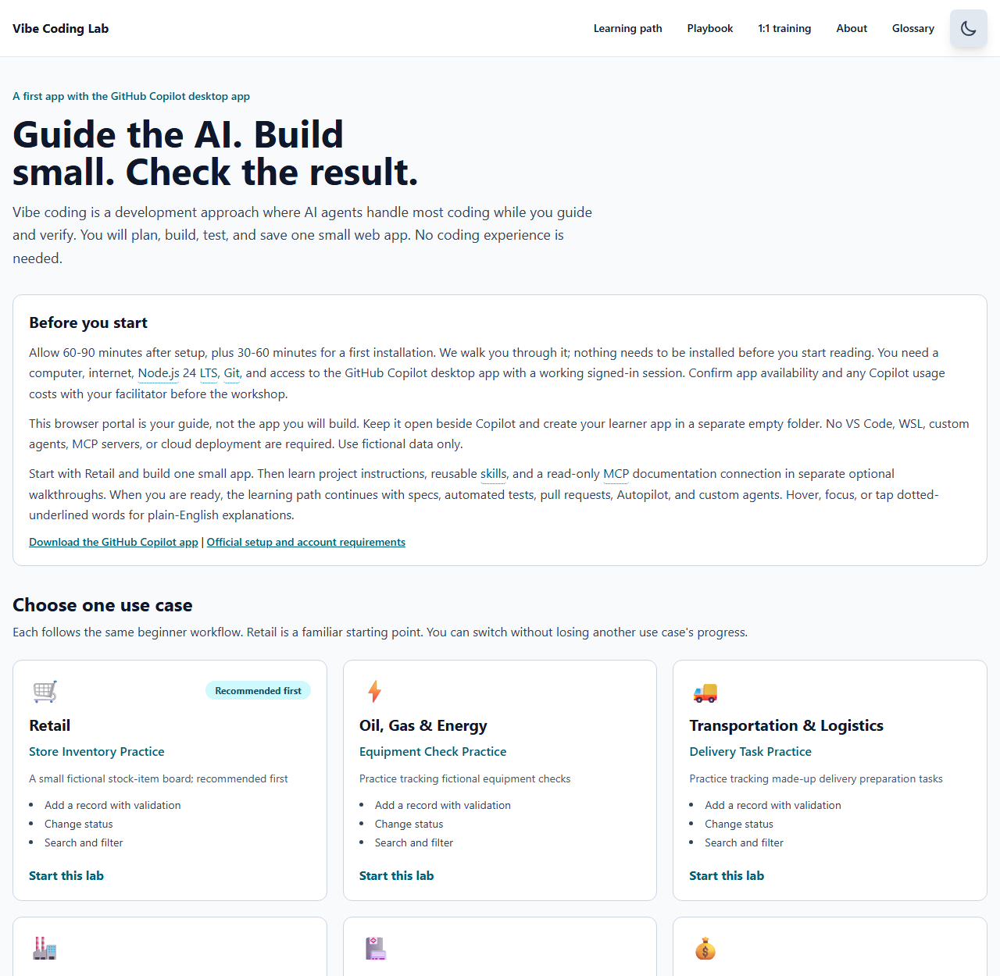
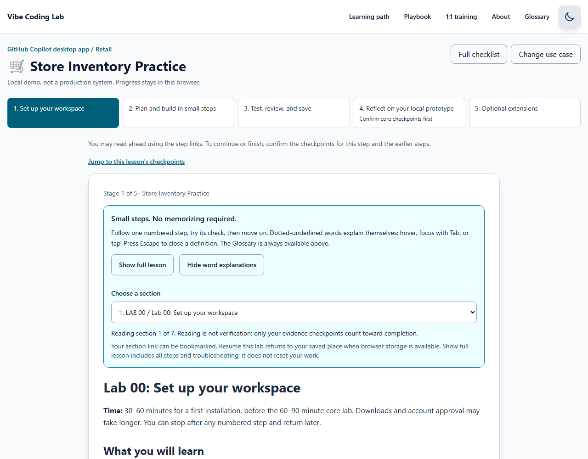
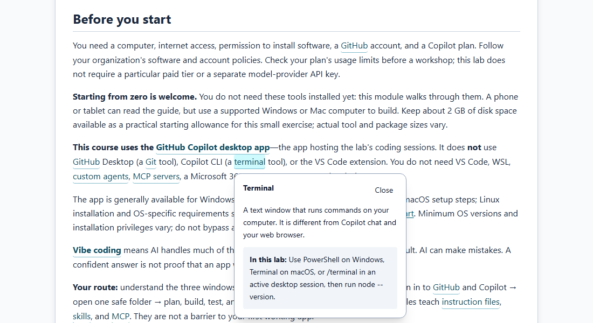
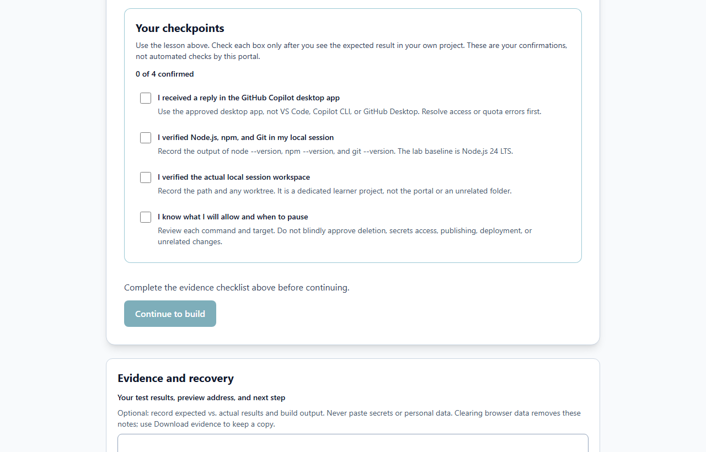

# Your vibe coding learning path

**Vibe coding** is a way of building software where an AI agent writes most of the code while you guide it and check the results. This page shows the whole journey, from your first prompt to running several agents at once. Every level uses the same small practice app, so you always know what "working" looks like.

> **Where should I start?** If you have never built an app with AI, start at **Level 1**. If you already finished the core lab, jump to **Level 2**. If you already use branches, pull requests, and tests every day, skim Level 2 and start **Level 3**.

## The three levels at a glance

| Level | Who it is for | You will be able to | Time |
| --- | --- | --- | --- |
| **1. Beginner** | No coding experience | Install the tools, plan a tiny app, build it one feature at a time, test it, and save it | 2–3 hours, including setup |
| **2. Intermediate** | You finished Level 1 | Give Copilot rules and better context, write a spec, use automated tests as guardrails, and debug without going in circles | 3–4 hours |
| **3. Advanced** | You are comfortable with Level 2 | Use branches, pull requests, AI review, and CI; run Autopilot safely in a sandbox; work in parallel sessions; build custom agents and automations | 4–6 hours |

You do not need to finish everything. **Stopping after Level 1 with a working, saved app is a real success.** Each module ends with a check you can do yourself, so you always know whether you are done.

## Level 1: Beginner — your first working app

You build **Store Inventory Practice**, a tiny list of fictional stock items. (The portal can swap in five other use cases with the same steps.)

1. [Set up your tools](lab-00-prerequisites.md) — the Copilot desktop app, Node.js, Git, and a safe empty folder.
2. [Make a small plan](lab-01-plan.md) — one record type, four small increments.
3. [Build one feature at a time](lab-02-build.md) — with screenshots of what each increment should look like.
4. [Test, review, and save](lab-03-test-and-save.md) — try good and bad inputs, then make a local commit.
5. [Explain what you built](lab-04-completion.md) — and what it cannot do yet.

**You are ready for Level 2 when:** your app passes the Lab 03 acceptance test, `npm run build` and `npm run lint` both exit with code 0, and you have a local commit.

## Level 2: Intermediate — work like a careful developer

The app stays small. What changes is **how** you work with Copilot.

| Module | What you practice | The proof you collect |
| --- | --- | --- |
| [Lab 06: Rules and a reusable skill](lab-06-instructions-and-skills.md) | Project instructions and one `SKILL.md` review recipe | A review that says **NOT RUN** instead of inventing results |
| [Lab 07: Connect one MCP server](lab-07-mcp.md) | Giving Copilot a read-only documentation tool | Real search and fetch results, then a clean removal |
| [Lab 08: Write a spec and manage context](lab-08-specs-and-context.md) | Turning an idea into a written spec, attaching the right files, checking context use | A committed spec with checkable acceptance criteria |
| [Lab 09: Use tests as guardrails](lab-09-tests-as-guardrails.md) | Adding Vitest, red-green testing, and testing the tests | A test you watched fail, then pass |
| [Lab 10: Debug and recover](lab-10-debug-and-recover.md) | Reading real errors, using Git to see what changed, escaping AI loops | A fixed bug with a test that stops it coming back |

**You are ready for Level 3 when:** your app has automated tests that run with `npm test`, you can explain one test you watched fail before it passed, and you have recovered from at least one real error without rewriting the app.

## Level 3: Advanced — direct agents like a tech lead

Now you let the agent do more on its own, so the guardrails matter more.

| Module | What you practice | The proof you collect |
| --- | --- | --- |
| [Lab 11: Branches, pull requests, and AI review](lab-11-branches-prs-and-review.md) | `/review`, `/security-review`, a private GitHub repository, CI checks, and a pull request | A pull request with green checks that **you** decided to merge |
| [Lab 12: Autopilot, parallel sessions, and sandboxing](lab-12-autopilot-and-parallel-sessions.md) | A written Autopilot brief, local sandboxing, and two sessions working at once | An Autopilot change that passed your own review and tests |
| [Lab 13: Custom agents, automations, and your capstone](lab-13-custom-agents-and-automations.md) | A read-only custom agent, a manual automation, and your own project plan | A capstone plan with a spec, tests, and a definition of done |

## Skills you build along the way

| Skill | Level 1 | Level 2 | Level 3 |
| --- | --- | --- | --- |
| **Asking** | One small request at a time | A written spec with acceptance criteria | A complete Autopilot brief with stop conditions |
| **Checking** | Click through the app yourself | Automated tests you watched fail and pass | CI checks on every pull request, plus AI and human review |
| **Saving** | A local commit | Small commits you can compare and undo | Branches and pull requests |
| **Safety** | Approve one command at a time | Project rules and read-only tools | Sandboxing, limited agent tools, and human merge decisions |
| **Recovering** | Paste the full error | Reproduce, read the diff, restore one file | Fork a session to try two fixes; let CI catch regressions |

## How to use this portal

The portal is the guide. It is **not** the app you build. Keep it in one browser tab and your app in another.

*The home page. Choose a use case to start Level 1, or open **Learning path** at the top to see every level.*

**Read one step at a time.** Long lessons have a **Read one step at a time** button. It shows one numbered step with all of its commands and checks. Use **Next section** when you finish, or **Choose a section** to jump.

*Reading one step at a time. **Show full lesson** brings back every step. Reading position is not a completion score.*

Inside each step, every code box says where its text goes: **Copilot chat**, a **terminal**, or a **file**. Use its **Copy** button instead of retyping.

**Look up words without leaving the page.** Words with a dotted underline have a plain-English explanation. Hover, tab to them, or tap them.

*A word explanation. Press Escape to close it, or turn explanations off with **Hide word explanations**.*

**Check off only what you saw yourself.** Each stage ends with checkpoints. They are your own report of what worked. The portal never inspects your computer or your app.

*Checkpoints and notes. **Download evidence** saves a copy you can keep or share with a facilitator.*

## Rules that apply at every level

- ⚠️ **Use made-up data only.** No real customers, patients, money, or passwords.
- ⚠️ **Read every command before you approve it.** "What will change, and can I undo it?"
- ⚠️ **The AI's confidence is not proof.** Your tests and your own clicks are the proof.
- ⚠️ **Save before big changes.** A commit is your undo button.
- ⚠️ **You decide what gets merged or published.** An agent can propose; you approve.

Keep the [vibe coding playbook](vibe-coding-playbook.md) open while you work. It has reusable prompts for every level.
